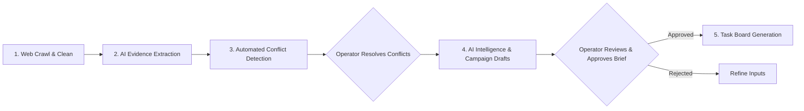

# ResearchFlow AI - Human-in-the-Loop AI Collaboration

## 1. Philosophy: AI Augmentation, Not Autonomous Abdication
ResearchFlow AI is intentionally designed around **Human-in-the-Loop (HITL)** architecture. Rather than treating AI as an infallible black box that autonomously publishes unreviewed content, the platform positions AI as a high-velocity intelligence assistant with strict human checkpoints.

---

## 2. The Human Verification Checkpoints

### Key Checkpoints:
1. **Conflict Resolution**: Flagged data discrepancies (e.g. conflicting pricing models) require human review to verify whether they represent billing variations, outdated information, or regional pricing.
2. **Campaign Brief Approval**: The generated campaign angle, primary message, and channel copy remain in `DRAFT` status until an authorized human team member approves or modifies the brief.
3. **Execution Task Accountability**: Generated tasks have clear justifications and assignable workflows so team members maintain full ownership of marketing execution.
