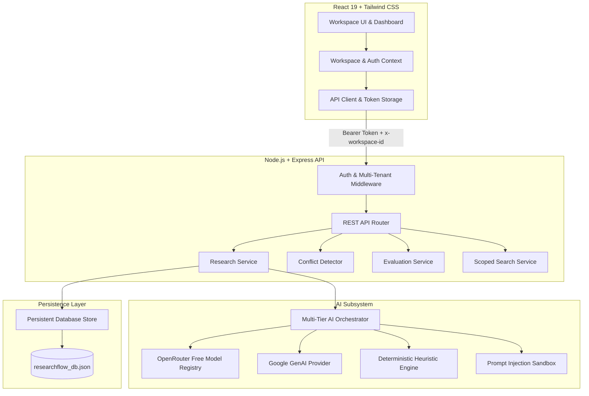
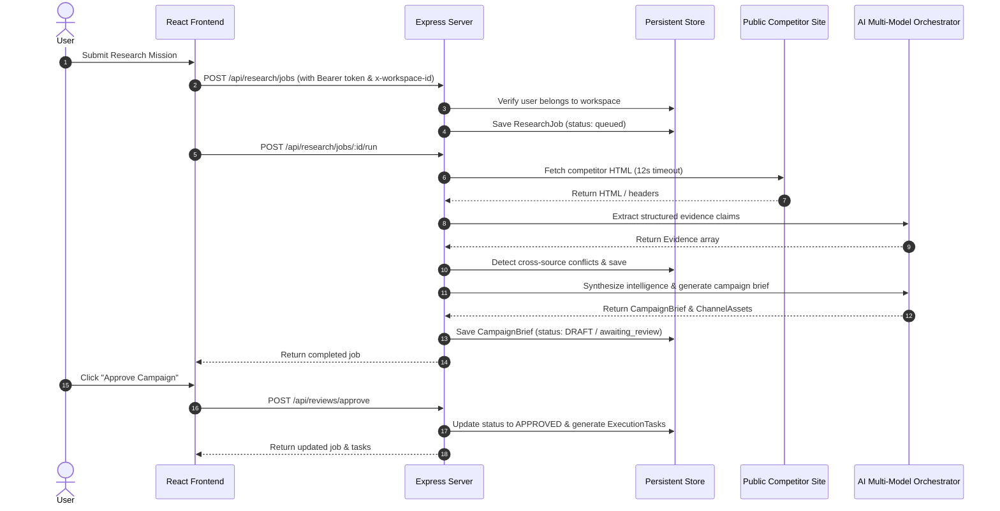

# ResearchFlow AI - System Architecture

## 1. Overview & Architectural Principles
ResearchFlow AI is designed as a secure, reactive, multi-tenant SaaS application built with a modern TypeScript stack. It operates with strict separation of concerns across presentation, business services, AI orchestration, and data persistence.

---

## 2. Layered Architecture

### Presentation Layer (Frontend)
- **Framework**: React 19 with functional components and React hooks.
- **Styling**: Tailwind CSS v4 design system with accessible contrast and custom badge components.
- **State Management**: `WorkspaceContext` managing session tokens, active workspace, demo sandbox toggle, and reactive toast notifications.
- **Component Architecture**:
  - `src/components/overview/`: Command Center dashboard with live KPI cards and review queue.
  - `src/components/research/`: Research job creation, live pipeline status, timeline scrubber, and comparison modal.
  - `src/components/evidence/`: Evidence Explorer with category filters, confidence badges, and claim diffing.
  - `src/components/conflicts/`: Cross-source conflict review and operator resolution modals.
  - `src/components/campaigns/`: Campaign strategy hub, visual ad creative studio, and AI red-team counter-strategy.
  - `src/components/tasks/`: Execution task board with drag-and-drop / click status transitions.
  - `src/components/evaluation/`: Automated 12-case benchmark dashboard.
  - `src/components/settings/`: Workspace configuration, team member management, and AI health center.

### Application & API Layer (Backend)
- **Runtime**: Node.js v20+ with Express and TypeScript.
- **Routing**: `server/api/routes.ts` providing modular REST endpoints.
- **Security & Multi-Tenancy**:
  - `getAuthUser`: Extracts and verifies session token or explicit demo session.
  - `getWorkspaceId`: Authorizes that the user is an owner or member of the requested workspace.
  - Returns `401 Unauthorized` for unauthenticated calls and `403 Forbidden` for cross-tenant access attempts.

### AI Orchestration Layer
- **Orchestrator**: `server/ai/orchestrator.ts` coordinates dynamic candidate model chains.
- **Candidate Chain Priority**:
  1. OpenRouter dynamic free models catalog (discovered via API).
  2. Gemini models (`gemini-3.7-flash`, `gemini-3.6-flash`).
  3. Structured self-repair parser.
  4. Deterministic heuristic fallback engine.
- **Prompt Injection Defense**: Untrusted web data is sanitized and placed inside strict XML `<untrusted_source_content>` wrappers.

### Persistence Layer
- **Store**: `server/db/store.ts` implementing `PersistentDatabaseStore`.
- **In-Memory & Atomic File Sync**: High-speed in-memory `Map` indices synced atomically to `data/researchflow_db.json` via debounced writes to prevent file corruption.

---

## 3. Request Lifecycle

