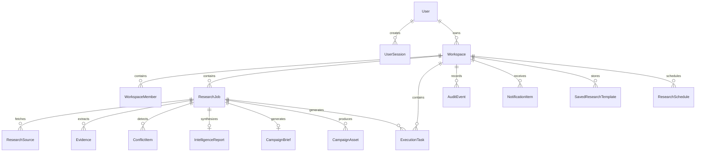

# ResearchFlow AI - Data Model Specification

## 1. Overview
The ResearchFlow AI data model is built around multi-tenant isolation, immutable audit trails, and strict evidence traceability. Every operational entity belongs to a `workspaceId`.

---

## 2. Entity Relationship Diagram



---

## 3. Data Dictionary

### 1. Workspace
```typescript
interface Workspace {
  id: string;             // e.g., "ws_12345_abcd"
  name: string;           // e.g., "Acme Growth Labs"
  businessName: string;   // e.g., "NextGen Resume AI"
  description: string;    // Product description
  industry: string;       // e.g., "B2B SaaS / HR Tech"
  targetAudience: string; // Target buyer persona
  ownerId: string;        // ID of the User who owns the workspace
  createdAt: string;      // ISO timestamp
  updatedAt: string;      // ISO timestamp
}
```

### 2. ResearchJob
```typescript
interface ResearchJob {
  id: string;                    // e.g., "job_12345_abcd"
  workspaceId: string;           // Foreign key to Workspace
  businessName: string;          // Business under analysis
  businessDescription: string;   // Contextual background
  campaignObjective: string;     // Strategic GTM goal
  targetAudience: string;        // Primary target persona
  competitorUrls: string[];      // List of target competitor URLs
  additionalUrls: string[];      // Additional reference URLs
  status: JobStatus;             // queued | validating | researching | extracting | normalizing | analyzing | generating | validating_output | awaiting_review | approved | rejected | partial | failed | cancelled
  currentStepMessage: string;    // Human-readable status progress
  progressPercent: number;       // 0 to 100
  sourcesCount: number;          // Total sources
  evidenceCount: number;         // Total extracted claims
  conflictsCount: number;        // Discrepancies detected
  isDemo?: boolean;              // Quarantined sample fixture flag
  errorMessage?: string;         // Failure reason if failed
  createdAt: string;             // ISO timestamp
  startedAt?: string;            // ISO timestamp
  completedAt?: string;          // ISO timestamp
  durationMs?: number;           // Total execution time in ms
}
```

### 3. Evidence
```typescript
interface Evidence {
  id: string;                   // e.g., "ev_job123_1"
  researchJobId: string;        // Foreign key to ResearchJob
  workspaceId: string;          // Foreign key to Workspace
  sourceId: string;             // Foreign key to ResearchSource
  category: ResearchCategory;   // "Pricing" | "Product Features" | "Target Audience" | "Positioning" | "GTM Strategy"
  claim: string;                // Normalized factual assertion
  supportingText: string;       // Direct snippet / quotation from source
  sourceUrl: string;            // Origin URL
  sourceTitle: string;          // Origin page title
  retrievedAt: string;          // Timestamp of crawl
  evidenceType: EvidenceType;   // "FACT" | "INFERENCE" | "RECOMMENDATION" | "WARNING"
  confidence: ConfidenceLevel;  // "HIGH" | "MEDIUM" | "LOW"
  normalizedValue?: string;     // e.g., "$19/mo" or "14-day free trial"
}
```

### 4. ConflictItem
```typescript
interface ConflictItem {
  id: string;                    // e.g., "conf_12345_pricing"
  researchJobId: string;         // Foreign key to ResearchJob
  workspaceId: string;           // Foreign key to Workspace
  category: ResearchCategory;    // e.g., "Pricing"
  description: string;           // Conflict summary
  severity: ConflictSeverity;    // "HIGH" | "MEDIUM" | "LOW"
  status: ConflictStatus;        // "UNRESOLVED" | "HUMAN_VERIFIED" | "DISMISSED"
  conflictingValues: {
    sourceId: string;
    sourceUrl: string;
    sourceTitle: string;
    value: string;
    evidenceId: string;
  }[];
  detectedAt: string;            // ISO timestamp
  resolvedAt?: string;           // ISO timestamp
  resolutionNotes?: string;      // Operator explanation
}
```

### 5. CampaignBrief
```typescript
interface CampaignBrief {
  id: string;                     // e.g., "brief_job123"
  researchJobId: string;          // Foreign key to ResearchJob
  workspaceId: string;            // Foreign key to Workspace
  executiveSummary: string;       // High-level strategic overview
  objective: string;              // Target campaign objective
  audience: string;               // Target audience definition
  coreProblem: string;            // Market pain point addressed
  positioning: string;            // Differentiated market stance
  campaignAngle: string;          // Creative lead hook
  primaryMessage: string;         // Core marketing message
  supportingMessages: string[];   // Secondary proof points
  recommendedChannels: string[];  // e.g. ["LinkedIn", "Cold Email", "SEO"]
  evidenceReferences: {
    evidenceId: string;
    claim: string;
  }[];
  confidence: ConfidenceLevel;    // "HIGH" | "MEDIUM" | "LOW"
  status: 'DRAFT' | 'APPROVED' | 'REJECTED';
  generatedAt: string;            // ISO timestamp
  approvedAt?: string;            // ISO timestamp
  approvedBy?: string;            // User name / reviewer
  reviewNotes?: string;           // Operator feedback
}
```

### 6. ExecutionTask
```typescript
interface ExecutionTask {
  id: string;                 // e.g., "task_job123_1"
  researchJobId: string;      // Foreign key to ResearchJob
  workspaceId: string;        // Foreign key to Workspace
  title: string;              // Action item title
  description: string;        // Step-by-step instructions
  priority: TaskPriority;     // "URGENT" | "HIGH" | "MEDIUM" | "LOW"
  category: TaskCategory;     // "POSITIONING" | "CONTENT" | "DISTRIBUTION" | "VERIFICATION"
  status: TaskStatus;         // "PENDING" | "IN_PROGRESS" | "COMPLETED"
  reason: string;             // Strategic justification
  evidenceReference?: string; // Grounded evidence reference
  createdAt: string;          // ISO timestamp
  completedAt?: string;       // ISO timestamp
}
```

### 7. AuditEvent
```typescript
interface AuditEvent {
  id: string;                 // e.g., "audit_12345"
  workspaceId: string;        // Foreign key to Workspace
  researchJobId?: string;     // Optional job reference
  eventType: string;          // e.g., "research_started", "conflict_detected", "approved"
  summary: string;            // Human-readable audit log
  details?: Record<string, any>; // JSON payload
  timestamp: string;          // Immutable timestamp
}
```
