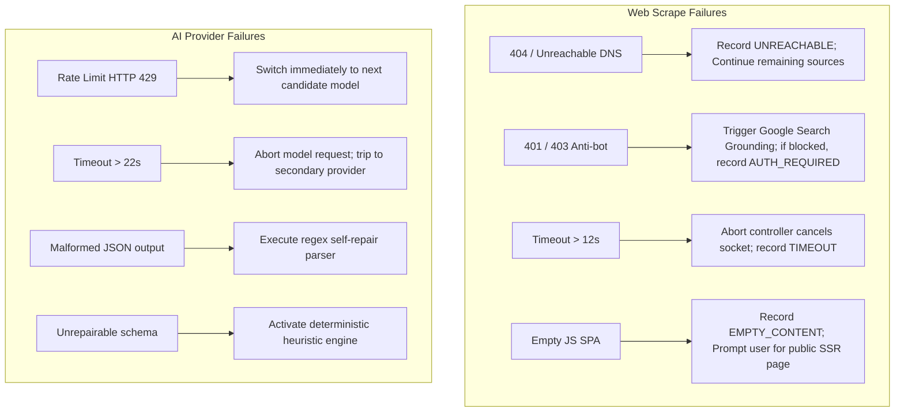

# ResearchFlow AI - Failure Recovery & Graceful Degradation

## 1. Resilience Architecture
ResearchFlow AI is engineered under the assumption that external web scrapers, remote AI APIs, and user inputs will periodically fail. The platform utilizes comprehensive graceful degradation strategies so that failure in any single component never crashes the system.

---

## 2. Failure Matrices & Recovery Protocols

---

## 3. Graceful Status Reporting

When failures occur, ResearchFlow AI presents transparent, honest status states rather than faking success or masking errors:

- **`partial`**: Displayed when at least one competitor source succeeded and one or more failed. The campaign strategy is generated from verified evidence while failed sources are clearly flagged in the pipeline overview.
- **`failed`**: Displayed when all sources are inaccessible or input validation fails. The operator receives an exact diagnostic message (e.g., *"Source returned HTTP 403: Access restricted by anti-bot firewall. Please provide an alternate public URL"*).
- **`UNRESOLVED` Conflict**: Highlighted with an amber badge when opposing claims exist across sources. The operator can verify or dismiss the conflict before campaign sign-off.
