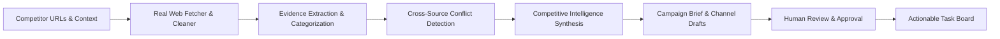

# ResearchFlow AI - Product Definition & Strategy

## 1. Executive Summary
ResearchFlow AI is an autonomous competitive intelligence and GTM campaign engine engineered for early-stage founders, growth marketers, and product managers. It transforms unstructured competitor websites into structured evidence claims, detects market positioning conflicts, synthesizes strategic market opportunities, and generates evidence-backed multi-channel campaign briefs (LinkedIn, Email, SEO) paired with actionable execution tasks.

---

## 2. The Problem
Modern product teams and growth marketers face major bottlenecks when conducting competitive research:
1. **Manual Labor & Time Sink**: Researching 3–5 competitor landing pages, feature tables, and pricing tiers typically consumes **4+ hours** per sprint.
2. **Unsupported Hallucinations in Generic AI**: General-purpose LLMs hallucinate competitor pricing, fabricate nonexistent features, and cannot cite traceable sources.
3. **No Provenance or Traceability**: Marketers struggle to know whether a claim is an exact quote, an inference, or an unverified marketing assertion.
4. **Execution Disconnect**: Traditional intelligence reports sit idle in Google Docs without translating into actionable marketing copy and trackable tasks.

---

## 3. The Solution: ResearchFlow AI
ResearchFlow AI solves these problems through an end-to-end, evidence-first pipeline:

### Core Value Pillars
1. **Zero-Hallucination Evidence Grounding**: Every finding, risk, and campaign claim cites a specific `evidenceId` backed by an extracted snippet and source URL.
2. **Honest Multi-Tenant SaaS Isolation**: User data is strictly segregated per workspace. New users start with an honest, clean canvas (0 fake jobs).
3. **Multi-Model AI Routing & Fallback**: Automatically discovers zero-cost OpenRouter models, falls back to Gemini, self-repairs corrupted schemas, and utilizes deterministic heuristic engines so workflows never crash.
4. **Integrated Execution Handoff**: Approving a campaign automatically generates prioritized execution tasks (e.g. landing page update, cold outreach setup, SEO content drafting).

---

## 4. Target Personas

### 1. The Startup Founder & CEO
- **Need**: Fast, accurate understanding of competitor positioning and pricing strategies before pitching investors or launching new products.
- **Key Workflow**: One-click research job submission, reviewing perceptual positioning matrix, and approving high-level campaign briefs.

### 2. The Head of Growth & Marketing Strategist
- **Need**: Evidence-backed campaign angles and tailored copy ready for immediate distribution across LinkedIn, Email, and organic search.
- **Key Workflow**: Reviewing channel drafts, editing core messaging, inspecting competitor battlecards, and exporting ad creative specs.

### 3. The Product Marketing Manager (PMM)
- **Need**: Systematic tracking of competitor tier updates, pricing shifts, and feature parity gaps.
- **Key Workflow**: Resolving cross-source conflicts, tracking competitive change radar, and managing execution tasks.

---

## 5. Key Modules

| Module | Core Functionality |
| :--- | :--- |
| **Command Center (Overview)** | Workspace health metrics, quick actions, active review queue, evidence stream, and recent activity. |
| **Research Engine** | Job lifecycle management, live web crawler, status scrubber, and run comparisons. |
| **Evidence Explorer** | Granular filtering by category (Pricing, Features, Audience, Positioning, GTM) and claim verification. |
| **Conflict Center** | Cross-source pricing and claim mismatch detection with human operator resolution logs. |
| **Competitive Intelligence** | Synthesized findings, positioning gaps, market opportunities, and B2B battlecards. |
| **Campaign Strategy Hub** | Evidence-backed campaign briefs, multi-channel draft assets, visual ad creative studio, and AI red-team simulations. |
| **Execution Tasks** | Persistent Kanban and list boards tracking action items generated upon campaign approval. |
| **Evaluation Benchmark** | Automated execution of 12 edge cases (TC01–TC12) with 6-dimension rubric scorecards. |
| **AI Health Center** | Live provider health, model latency metrics, zero-cost catalog sync, and failure injection testing. |
