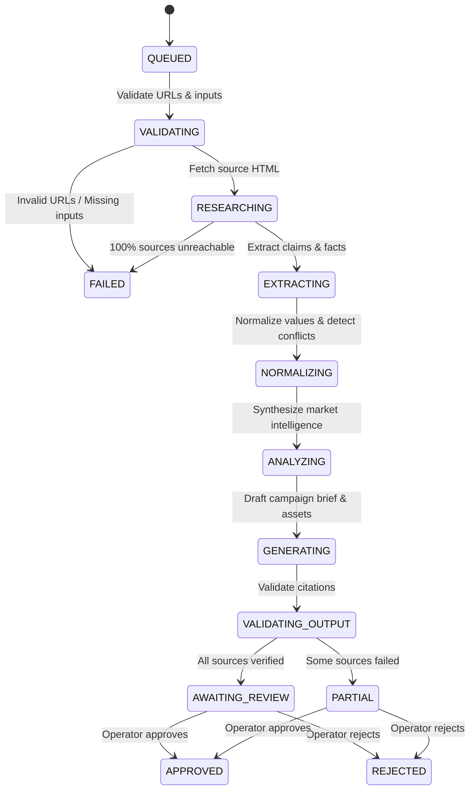

# ResearchFlow AI - Research Engine & Web Crawler

## 1. Overview
The Research Engine (`server/research/fetcher.ts` and `server/services/researchService.ts`) is responsible for fetching, validating, sanitizing, and processing public competitor websites into structured evidence.

---

## 2. Research Pipeline Lifecycle

---

## 3. Web Fetcher Specifications

### 1. Protocol & Syntax Validation
- Requires valid `http:` or `https:` protocol.
- Rejects localhost, internal RFC1918 IPs, or malformed syntax before issuing network requests.

### 2. Network Fetch & Timeout Control
- Bounded to a **12-second timeout** using `AbortController`.
- Sends realistic modern browser user-agent headers to minimize false-positive anti-bot blocks.

### 3. HTTP Status Classification

| HTTP Status | Pipeline Classification | System Action |
| :--- | :--- | :--- |
| `200 OK` | `COMPLETED` | Extracts title, meta description, and cleaned body text. |
| `401 Unauthorized` | `AUTH_REQUIRED` | Records failure reason honestly; prompts user for public URL. |
| `403 Forbidden` | `BLOCKED` | Attempts Google Search Grounding fallback; if blocked, records reason. |
| `404 Not Found` | `UNREACHABLE` | Records missing page failure; does not invent or hallucinate data. |
| `504 Gateway Timeout` | `TIMEOUT` | Records connection timeout; flags for retry. |
| Network Error / DNS | `UNREACHABLE` | Records offline domain status; avoids crashing. |

---

## 4. Google Search Grounding Fallback
When direct HTTP scraping is blocked by aggressive anti-bot firewalls (Cloudflare/Akamai) or client-side JavaScript Single Page Applications (SPAs) without server-side rendering:
1. The engine triggers live **Google Search Grounding** using the Gemini API.
2. The search engine retrieves live indexed search snippets, pricing metadata, and company descriptions.
3. Grounding sources are tagged as `(Live Search Grounded)` with verified citations preserved.
