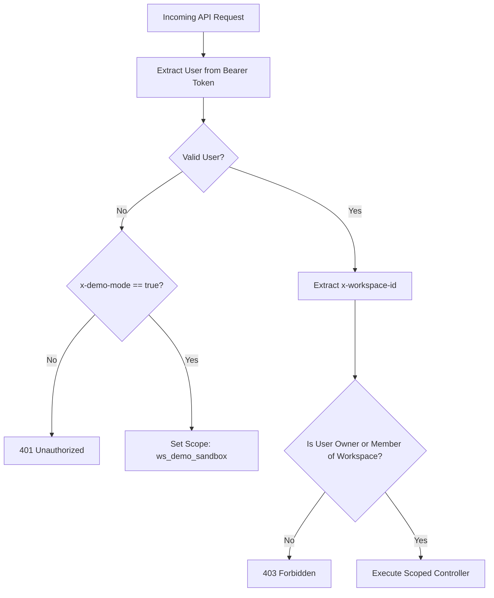

# ResearchFlow AI - Security & Multi-Tenant Isolation

## 1. Security Philosophy
In ResearchFlow AI, **workspace isolation is a strict security boundary**, not merely a UI convenience. Market research, pricing teardowns, and positioning strategies are sensitive intellectual property.

---

## 2. Authentication & Session Management
- **Token-Based Sessions**: Secure cryptographically random session tokens (32 bytes hex) issued upon authentication.
- **Header Protocol**: Client transmits `Authorization: Bearer <token>` or `x-session-token: <token>`.
- **Password Hashing**: Passwords hashed using PBKDF2 (`crypto.pbkdf2Sync`) with 100,000 iterations of SHA-512 and unique 16-byte random salts.
- **Session Expiration**: Automatic 30-day session TTL with expiration validation on every request.

---

## 3. Server-Side Multi-Tenant Authorization (IDOR Prevention)

### Authorization Rules:
1. **No Implicit Fallback in Live Mode**: Live API requests never fall back to default founder data. Unauthenticated calls receive HTTP `401 Unauthorized`.
2. **Strict Membership Verification**: `db.isUserAuthorizedForWorkspace(user.id, targetWorkspaceId)` checks workspace ownership (`ownerId === user.id`) and membership lists (`members.some(m => m.id === user.id || m.email === user.email)`).
3. **Cross-Tenant IDOR Prevention**: Attempting to query or modify resources belonging to another workspace returns HTTP `403 Forbidden` or `404 Not Found`.
4. **Scoped Global Search**: Database queries strictly filter indices using the authorized `workspaceId`.

---

## 4. Demo Mode Quarantine
- Demo mode operates exclusively within `ws_demo_sandbox` (owned by `usr_demo_founder`).
- Real registered user workspaces are isolated and will never have sample fixtures or demo jobs automatically mixed into their private records.
- New user registrations receive an **honestly empty workspace** with 0 pre-populated research jobs.

---

## 5. Security Audit Logging
Every sensitive action creates an immutable `AuditEvent` record:
- Workspace creation & member invitations
- Research job creation & execution starts
- Evidence extraction & conflict detection
- Human campaign approvals & rejections
- Task status modifications
